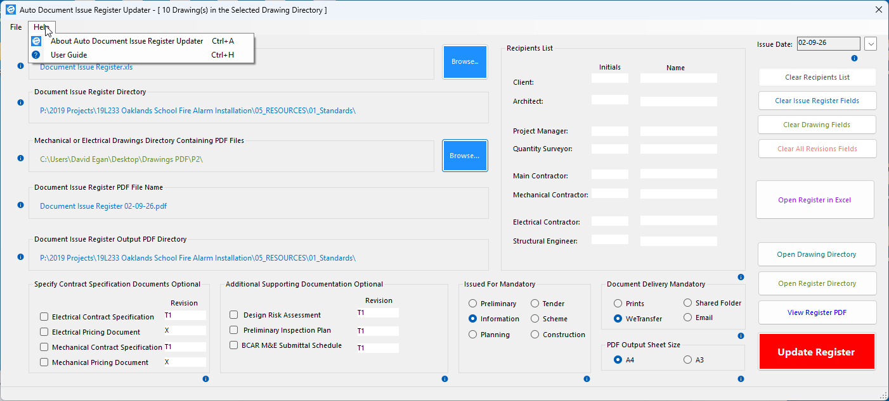

#  Auto Document Issue Register Updater (Test Case)

<b>On-premises Auto Document Issue Register Updater for AEC organisations</b>

Auto Document Issue Register Updater has been designed to make completing a document issue easier and paractical.

Built with <b>as a Winforms C#,</b> application.

**Repository note**

The production application source code is private because Auto Document Issue Register Updater was developed as a test case. This repository intentionally contains the public technical documentation, screenshots and video demonstration rather than the proprietary application source.

## At a Glance

✔ Full-stack enterprise Winforms application
✔ Comprehensive documentation

# The problem

Completing a Document Issue register typically is a time consuming, tedious and error intensive task completed manually. This manual approach is how most organisations complete a Document Issue Register even today.

# 🧭 Auto Document Issue Register Updater
<h3>Complete a Document Issue Register in Seconds</h3> 

---


<i>Auto Document Issue Register Updater allows the user to complete a Document Issue Register the quick and easy way.</i>
<p align="left">

</p>
💡 **Tip:** Click the hero image to view the full-size version.

---
<a id="enterprise-project"></a>

## 📑 Table of Contents

| 📖 Overview | 🛠️ Technical | 📚 Resources | 📈 About |
|:-----------:|:------------:|:------------:|:----------:|
| 🌐 [Platform Overview](#platform-overview) | ✨ [Key Features](#key-features) | 📦 [Contents](#repository-contents) | 📊 [Results](#results) |
| 📁 [Directory Structure](#typical-engineering-project-directory-structure) | 🛠️ [Tech Stack](#tech-stack) | 📚 [Documentation](#documentation) | 🚦 [Project Status](#project-status) |
| 💡 [Solution](#solution) | 🏗️ [Enola Architecture](#enola-architecture) | 🖼️ [Screenshots](#screenshots-project-navigator--enola) | 👤 [Author](#author) |
| 👥 [Who Is It For](#who-is-it-for) | ⚙️ [Infrastructure](#operational-infrastructure) | 🔴 [Live Demo](#live-demo) | |
| 🚀 [Why It's Better](#why-is-it-better-than-traditional-workflows) | | | |


---
[Back to top](#enterprise-project)
<a id="platform-overview"></a>
## 🌐 Platform Overview
The Auto Document Issue Register Updater was originally developed for the AEC (Architecture, Engineering & Construction) industry, where organisations commonly update and maintain document issue registers.

[Back to top](#enterprise-project)
<a id="repository-contents"></a>
## 📦 Repository Contents

```text

/guide/user-guide
  Auto Document Issue Register Updater User Guide Version 1.0.(PDF)

/images/
  Auto Document Issue Register Updater screenshots

```

---
[Back to top](#enterprise-project)
<a id="documentation"></a>
## 📚 Documentation

This repository includes:

* User Guide
* Application Screenshots
---
[Back to top](#enterprise-project)
<a id="key-features"></a>
## ✨Key Features

- Project Search — Quickly find projects by structured metadata.
- Project Management — Create, edit, and manage project records.
- Directory Navigation — Open project locations directly from Navigator.
- Multi-User Access — Multiple users can work concurrently.
- Record Locking — Prevents conflicting edits or deletes.
- Automatic Lock Recovery — Enola releases abandoned/stale locks.
- Primary/Backup Failover — Enola maintains lock-recovery availability.
- Authentication & Authorisation — Account and role-based access control.
- Administration Portal — Manage users, permissions and system data.
- Account Recovery — Email-assisted password recovery.
- Audit/Operational Logging — Records important system/service activity.
- On-Premises Deployment — Runs within the organisation's existing infrastructure.

---
[Back to top](#enterprise-project)
<a id="tech-stack"></a>
## 🛠 Tech Stack

| Component          | Technology                        | Responsibility                                     |
| ------------------ | --------------------------------- | -------------------------------------------------- |
| Operator client    | C# WinForms                       | Auto Document Issue Register Client application    |


<h4>Integrated Development Environment</h4>

- Microsoft Visual Studio 2022
  
<h4>Packager-Deployment</h4>

- Microsoft Visual Studio 2022 Installer Projects
--- 
## Does your workflow fit the Project Navigator way of working?

If your company’s directory structure aligns with the sample directory structures defined above, the Project Navigator web application can be adapted and used to manage and coordinate the project directory workflow throughout your organisation.

--- 

## Project Navigator and Enola Deployment Architecture

The Navigator system consists of approximately 62 PHP scripts that collectively define the Navigator web application. This application represents the user-facing side of the system and is the primary interface through which users interact with the platform.

Enola, by contrast, functions as the backend service layer of the overall system architecture.

The intended deployment model for both Navigator and Enola is an on-premises company file server environment. All application data is stored locally within the company infrastructure rather than in external cloud services.

The deployment stack is based on XAMPP, which provides the core runtime environment, including:

* Apache as the web server
* PHP as the application runtime
* MariaDB as the database server

Typically, the Navigator web application is deployed under Apache within the XAMPP environment.

MariaDB hosts the application databases and tables, including:

* The `projects` database and corresponding `projects` table
* The `accounts` database and corresponding `user_accounts` table

Enola is designed to operate as a continuously running backend service. Its primary responsibility is to connect to the MariaDB server and monitor both the `projects` and `user_accounts` tables for locked records.

Enola polls these tables approximately once per second. If locked records are detected, Enola evaluates the age of the lock. Any record that has remained locked for five minutes or longer is automatically unlocked by Enola.

This automatic unlocking process applies to both:

* project records within the `projects` table
* user account records within the `user_accounts` table

The purpose of this mechanism is to prevent stale or abandoned record locks from persisting indefinitely, thereby maintaining record accessibility and operational continuity for users of the Project Navigator application.

Once deployed, the Project Navigator system operates autonomously.

--- 

[Back to top](#enterprise-project)
<a id="screenshots-project-navigator--enola"></a>
## 🖼️ Screenshots Auto Document Issue Register

<h3>New User Registration & Login</h3>

<p align="left">
  
  
</p>
<h3>About Box</h3>
<p align="left">

</p>

💡 **Tip:** Click the image for the full-size version.

---

<a id="solution"></a>
[Back to top](#enterprise-project)
## 💡 Solution

The Project Navigator centralises historical and active construction project information into a structured, searchable directory environment where project records can be located in seconds—eliminating manual directory navigation, reducing search time, and improving access to construction knowledge.

The platform provides a shared catalogue of project information across the organisation, enabling AEC teams to:

- Quickly retrieve historical and current project records
- Access project information through a structured search environment
- Improve visibility of engineering projects across departments
- Increase accessibility to organisational knowledge and technical records
- Reduce time spent locating engineering documentation and project assets
- Bookmark and quickly access frequently used projects

By consolidating project directory information into a unified catalogue system, the solution improves efficiency, strengthens knowledge retention, and supports faster access to the information required for construction decision-making.

---
[Back to top](#enterprise-project)
<a id="who-is-it-for"></a>
## 👥 Who Is It For?

Designed for AEC organisations managing multi-user engineering workflows involving:

* Architects
* Engineers
* BIM Coordinators
* BIM Technicians
* CAD Technicians
* Contractors
* Document Controllers

---
[Back to top](#enterprise-project)
<a id="why-is-it-better-than-traditional-workflows"></a>
## 🚀 Why Is It Better Than Traditional Workflows?

Instead of relying on disconnected directories, emails, spreadsheets, and local copies, the platform provides a centralised network-accessible project catalogue where all users operate from the same shared directory structure and project data.

This reduces time spent searching for project directories, improves coordination across teams, and ensures construction information remains:

- Accessible
- Structured
- Consistently available
- Shared across all users

---
[Back to top](#enterprise-project)
<a id="operational-infrastructure"></a>
## ⚙️ Operational Infrastructure

**Development and Test Environment**

- Developed and tested on Windows 11 Pro box.

**Software Requirements**
- Microsoft Office 365 Installed on users computer.

---
[Back to top](#enterprise-project)
<a id="live-demo"></a>
## 🔴 Live Demo

[Auto Document Issue Register Updater Demo](https://youtu.be/Vg66_TL9fbM)

---
[Back to top](#enterprise-project)
<a id="results"></a>
## 📊 Results


[Back to top](#enterprise-project)
<a id="project-status"></a>
## 🚦 Project Status

✅ Completed Project  

---
[Back to top](#enterprise-project)
<a id="author"></a>
## 👤 Author

David Egan

Sole Software Developer, Systems Designer, and Solutions Architect for the Auto Document Issue Register Updater Application

<a href="https://www.linkedin.com/in/davidpatrickegan">LinkedIn</a> 
